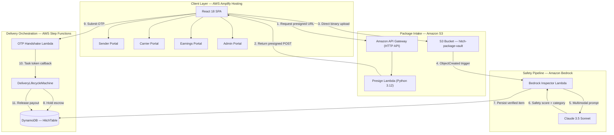

# Hitch

[](https://main.d22ejgaxykue38.amplifyapp.com)
[](https://aws.amazon.com/serverless/sam/)
[](https://aws.amazon.com/bedrock/)
[](https://react.dev/)

> Rail · Road · Runway · Delivered.

**Hitch** is a serverless peer-to-peer intercity logistics platform that converts verified daily travelers into last-mile courier carriers across Indian city corridors. Senders access same-day intercity delivery at significantly lower cost than traditional courier operators; carriers monetize spare luggage capacity on trips they are already taking.

**Production:** https://main.d22ejgaxykue38.amplifyapp.com

---

## Architecture



---

## AWS Services

| Service | Role |
| :--- | :--- |
| **Amazon Bedrock** | Multimodal package safety inspection via Claude 3.5 Sonnet. Detects prohibited items, scores packaging integrity, and classifies volume tier. |
| **AWS Step Functions** | State machine governing the full delivery lifecycle: escrow hold → carrier match → pickup OTP → in-transit → delivery OTP → payout release. |
| **Amazon S3** | `hitch-package-vault` bucket receives raw parcel intake photos via short-lived presigned POST URLs (15-minute TTL, 5 MB content-length enforcement). |
| **AWS Lambda** | Python 3.12 functions for presigned URL generation, Bedrock inspection pipeline, and OTP handshake task-token callbacks. |
| **Amazon DynamoDB** | Single-table design (`HitchTable`) storing package records, carrier trip corridors, match assignments, and dual OTP tokens. |
| **Amazon API Gateway** | CORS-enabled HTTP API routing client requests to Lambda with least-privilege IAM execution roles. |
| **AWS Amplify Hosting** | CI/CD pipeline with automatic branch deployments on every push to `main`. |

---

## Pricing Model

Hitch applies a fixed **38 / 62 revenue split** on every transaction.

| Party | Share | Settlement |
| :--- | :--- | :--- |
| Carrier (traveler) | 62% | Instant payout to Amazon Pay / UPI wallet on delivery OTP verification |
| Hitch platform | 38% | Covers infrastructure, payment gateway, tamper-seal operations, and gross margin |

### Per-Kilogram Rate Schedule

| Transport Mode | Rate | Minimum Floor |
| :--- | :---: | :---: |
| Train (Vande Bharat / Express) | ₹70 / kg | ₹100 |
| Bus (Intercity Volvo / Sleeper) | ₹60 / kg | ₹80 |
| Car (Expressway / Trunk road) | ₹90 / kg | ₹120 |
| Flight (Domestic) | ₹150 / kg | ₹250 |
| Bike (Intra-city quick courier) | ₹50 / kg | ₹60 |

**Pricing formula:**

```
rate_per_kg    = TRANSPORT_RATES[mode]
base_price     = max(weight_kg × rate_per_kg, floor_price)
carrier_payout = base_price × 0.62
platform_fee   = base_price × 0.38
```

---

## Repository Structure

```
hitch/
├── frontend/
│   ├── src/
│   │   ├── App.jsx                           # Root component; portal routing, shared state
│   │   ├── components/
│   │   │   ├── SenderPortal.jsx              # Sender booking wizard + payment flow
│   │   │   ├── CarrierPortal.jsx             # Carrier trip registration + payout preview
│   │   │   ├── EarningsPortal.jsx            # Carrier wallet, ledger, withdrawal
│   │   │   ├── AdminPortal.jsx               # Ops dashboard; OTP state feed
│   │   │   ├── RoutePreviewIllustration.jsx  # Animated SVG route visualizations
│   │   │   └── PersonCarrierIcon.jsx         # Custom SVG brand icon
│   │   └── utils/
│   │       └── pricing.js                    # calculatePricing() — transport rate engine
│   ├── tailwind.config.js
│   └── vite.config.js
└── backend/
    ├── template.yaml                         # AWS SAM infrastructure definition
    ├── functions/
    │   ├── presign/                          # S3 presigned URL generator
    │   ├── bedrock_inspector/                # Package safety pipeline
    │   └── handshake/                        # OTP task-token callback
    └── core/
        └── matcher.py                        # Corridor-to-trip matching engine
```

---

## Local Development

### Prerequisites

- Node.js 18+
- Python 3.12
- AWS SAM CLI
- Docker (for local Lambda invocation)

### Run frontend

```bash
cd frontend
npm install
npm run dev
# Open http://localhost:3000
```

### Run matcher unit tests

```bash
python3 backend/core/matcher.py
```

---

## Deployment

The React frontend deploys automatically to AWS Amplify on every push to `main`. To deploy or update the serverless backend stack:

```bash
# Build Lambda functions and resolve dependencies
sam build --template backend/template.yaml

# Interactive guided deploy (first run)
sam deploy --guided \
  --stack-name hitch-prod \
  --region ap-south-1

# Subsequent deploys
sam deploy --template backend/template.yaml \
  --stack-name hitch-prod \
  --region ap-south-1
```

---

## Security

- **Presigned upload enforcement:** All package photo uploads flow client-direct to S3 using presigned POST URLs with a 15-minute TTL and a 5 MB `content-length-range` condition. No package binary data transits the application servers.
- **Least-privilege IAM:** Each Lambda function is scoped to the minimum IAM actions required for its operation. No shared execution roles across functions.
- **Escrow isolation:** Payout release is gated exclusively through the Step Functions state machine task-token mechanism, preventing out-of-band settlement.
- **Intermediary safe harbor:** Platform operations comply with Section 79 of the Information Technology Act 2000 as a technology intermediary.
