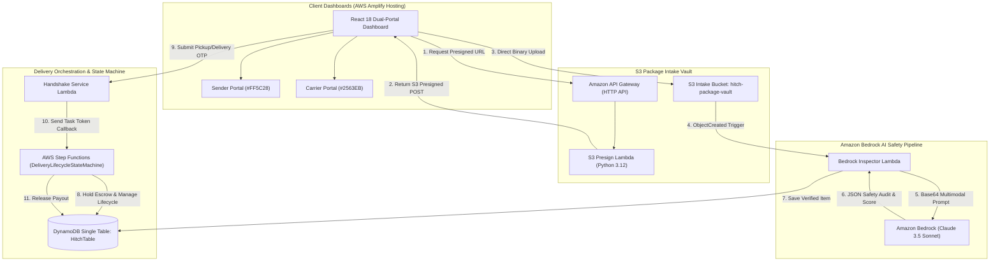

# Hitch 🚀 | Cloud-Native Peer-to-Peer Intercity Logistics Grid

[](https://main.d22ejgaxykue38.amplifyapp.com)
[](https://aws.amazon.com/serverless/sam/)
[](https://aws.amazon.com/bedrock/)
[](https://aws.amazon.com/step-functions/)
[](https://aws.amazon.com/amplify/)

> **"Rail · Road · Runway · Delivered."**  
> **Live Production URL:** [https://main.d22ejgaxykue38.amplifyapp.com](https://main.d22ejgaxykue38.amplifyapp.com)

**Hitch** is an enterprise-grade, serverless peer-to-peer intercity logistics grid built on AWS for the **Bharat Builds on AWS** Hackathon. Hitch turns daily travelers across 173 Indian cities (on Vande Bharat trains, intercity buses, expressway carpools, and domestic flights) into verified courier carriers — enabling **same-day intercity delivery at 50–70% lower cost** than traditional legacy shippers.

---

## 💰 Unit Economics & Commission Engine

Hitch operates on an automated **38% / 62% Revenue Split Model**:
* **Carrier Take-Home Payout (62%):** Instantly settled to the traveler's Amazon Pay / UPI wallet upon 4-digit Delivery OTP verification.
* **Hitch Platform Take Rate (38%):** Covers AWS infrastructure, Bedrock AI visual inspection models, tamper-evident seals, payment gateway fees, and gross platform margin.

### Transport Mode Per-Kg Slabs:
* 🚆 **Train (Vande Bharat / Express):** `₹70 / kg` *(Min. floor ₹100)*
* 🚌 **Bus (Intercity Volvo / Sleeper):** `₹60 / kg` *(Min. floor ₹80)*
* 🚗 **Car (Expressway / Trunk):** `₹90 / kg` *(Min. floor ₹120)*
* ✈️ **Flight (Domestic Airlines):** `₹150 / kg` *(Min. floor ₹250)*
* 🛵 **Bike (Quick Courier):** `₹50 / kg` *(Min. floor ₹60)*

---

## 🏗 System Architecture



---

## ☁️ AWS Services Utilization Matrix

| AWS Service | Role in Hitch Architecture |
| :--- | :--- |
| **Amazon Bedrock** | Multimodal safety inspection using Claude 3.5 Sonnet to detect prohibited items, compute packaging integrity scores, and categorize volume tiers. |
| **AWS Step Functions** | State machine orchestrating the end-to-end delivery lifecycle (Escrow -> Carrier Callback -> Pickup OTP Handshake -> In-Transit -> Delivery OTP -> Payout Release). |
| **Amazon S3** | `hitch-package-vault` bucket storing raw parcel intake photos with presigned POST uploads and event triggers. |
| **AWS Lambda** | Python 3.12 serverless compute for S3 presigned URL generation, Bedrock AI inspection, and OTP handshake callbacks. |
| **Amazon DynamoDB** | Single-table (`HitchTable`) storing package metadata, commuter trip corridors, matches, and dual OTP handshake tokens. |
| **Amazon API Gateway** | CORS-enabled HTTP API routing intake and handshake requests with least-privilege security. |
| **AWS Amplify Hosting** | CI/CD automated deployment of the React dual-portal dashboard. |

---

## 🛠 Local Development Setup

### 1. Prerequisites
- Node.js 18+ & npm
- Python 3.12
- AWS SAM CLI & Docker (for local Lambda testing)

### 2. Run Frontend Dashboard Locally
```bash
cd frontend
npm install
npm run dev
```
Open `http://localhost:3000` to access the Sender, Carrier, and Live Delivery Tracker portals.

### 3. Verify Core Domain Matching Engine
```bash
python3 backend/core/matcher.py
```

---

## 🚀 AWS SAM Deployment Instructions

To build and deploy the entire serverless infrastructure stack on AWS:

```bash
# 1. Build SAM Application
sam build --template backend/template.yaml

# 2. Deploy to AWS Account
sam deploy --guided \
  --stack-name hitch-aws \
  --region ap-south-1
```

---

## 🛡 Security & Compliance
- **Direct S3 Intake**: Secure direct client-to-S3 uploads enforced via 15-minute expiring presigned POST URLs and content-length limits (max 5MB).
- **Intermediary Safe Harbor**: Operations comply with Section 79 of the Information Technology Act 2000 as a technology platform intermediary.
